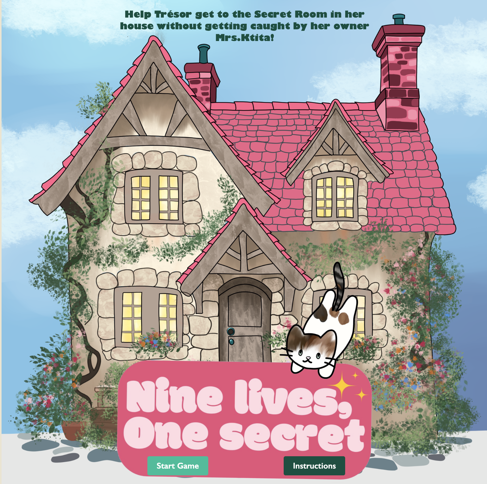
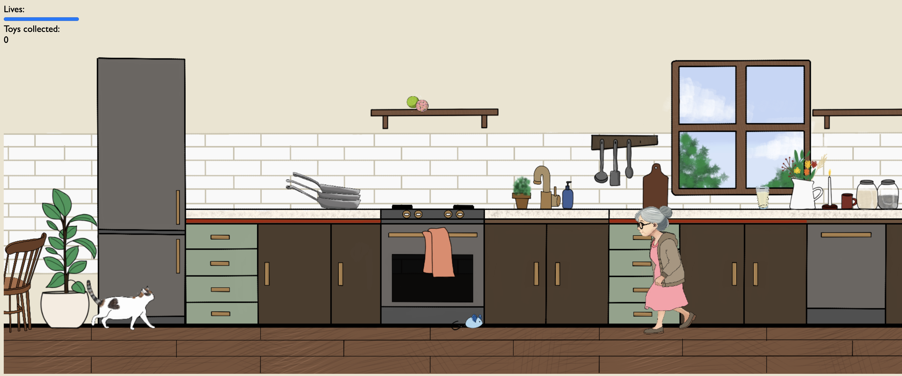
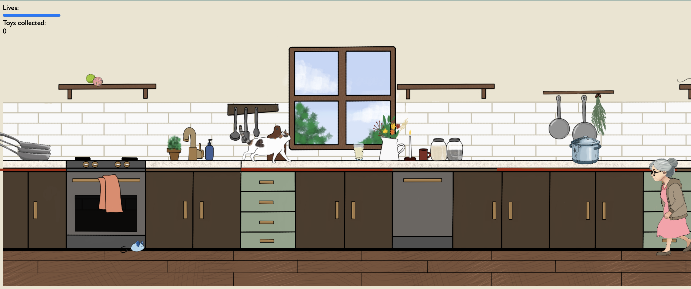
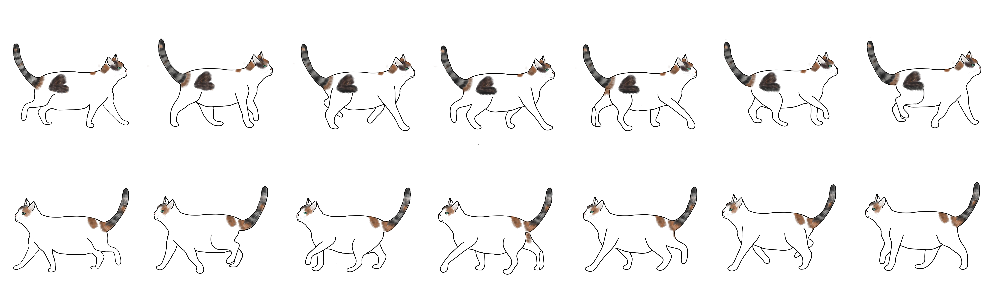

# CCL1
# 🎮 **Nine lives, one secret** 

> **Short Pitch**: Help Trésor, a playful and curious cat get to the secret room in her cozy little home without getting caught by her owner, Mrs. Ktita.
> 

---

## 🌐 **Play the Game**
[Click here to play the game!](https://rhaj20.github.io/CCL/) 

---

## 📸 **Screenshots**

### Menu:

  
  
*Figure 1: Start screen of game.*

---

### Main Gameplay:

  
  
*Figure 2: Example of gameplay in action.*

  
  
*Figure 3: Example of gameplay in action.*

  
  
*Figure 4: Example of gameplay in action.*

---

## 🎨 **Spritesheets**
Below are the sprites used to create the background, the characters and objects in the game:

### Player Character:

  
  
*Figure 5: Player character animation.*

---

### Enemies and NPCs:

  
  
*Figure 6: Enemy animation.*

---

## ✍️ **Reflection**

### What went well:
- **The drawings:** Drawing the background, the characters and objects was so fun and easy since I knew how I wanted things to look. 
- **Winning/ losing conditions:** Doing the if/else statements, the canvases, the gaining/ losing lives... for the Winning/ Losing situation was easier than I thought.

### Challenges:
- **Gameloop problem:** I had a problem with my player not appearing on my screen sometimes, I though it was due to so many other problems but it was a problem in the gameloop.
- **The gravity code:** When I applied the gravity code with mine, it was not working so it took me some time to figure out why.

### Lessons Learned:
- **Not shying away from asking questions:** Lecturers and tutors were there to help us all the time so throughout the weeks I became more comfortable with asking questions which helped a lot.
- **Time management is crucial:** Learning to do tasks effectively and well was hard to do at the beginning and I was wasting time on meaningless things but by the end of the two weeks I became better at being efficient and I noticed how important it is.
